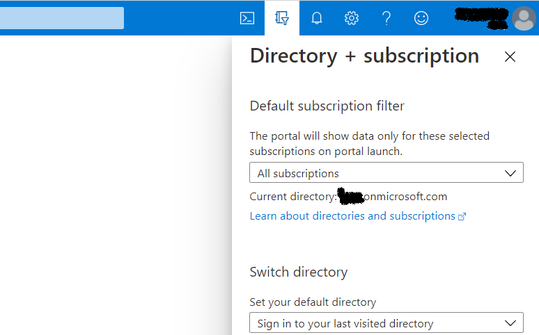
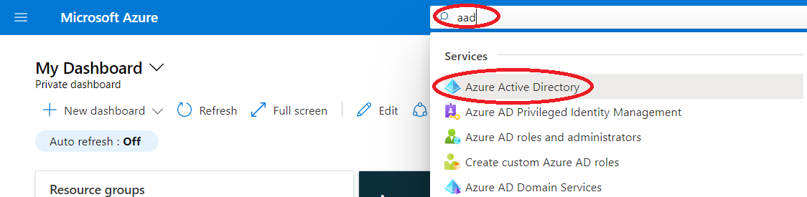
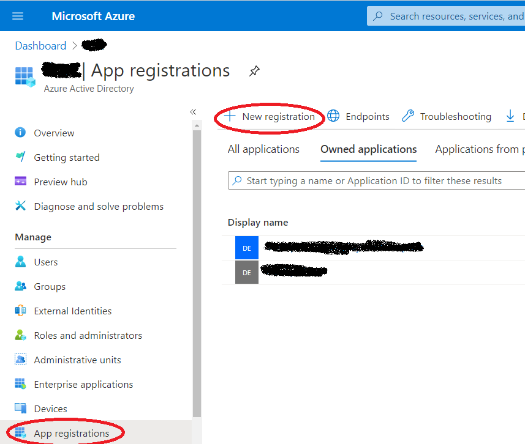
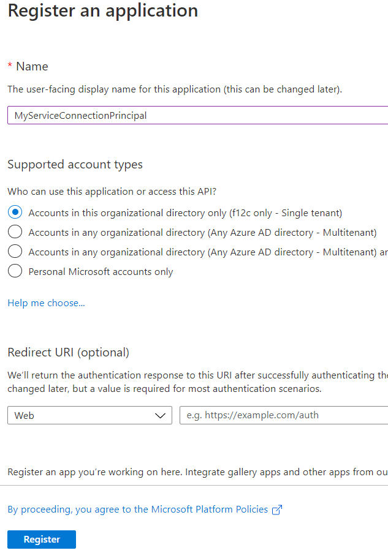
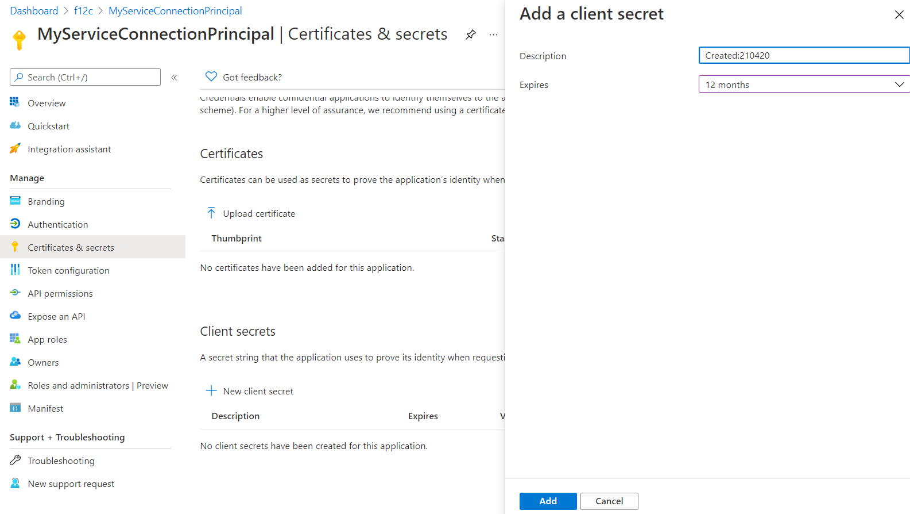
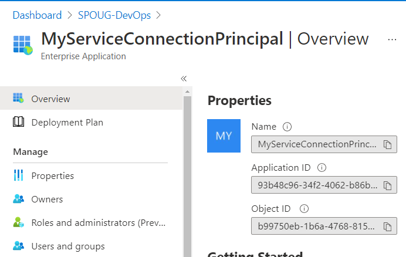

# Create Azure Service principal

**Prerequisites:**

- An Azure Subscription. 

- Owner permissions to the Azure subscription or an Azure Resource Group. 

- You need to have permissions to create 'App registrations' in your AAD (Azure Active Directory Tenant). This is allowed by default, but might have been restricted in your AAD tenant. See [Delegate app registration permissions in Azure Active Directory](https://docs.microsoft.com/en-us/azure/active-directory/roles/delegate-app-roles) for details on how to provide access.

**Open portal.azure.com.**

Sign in using your credentials. 

Ensure that you are in the right directory. 

From the search resources bar search for 'AAD' and select Azure Active Directory. 

Go to 'App registrations' and select 'New registration'

 

Fill in the form according to the environment to be configured.

|Name|Sample value|
|-|-|
|Name|Provide a meaningfull name here|
|Who can use this application or access this API?|Accounts in this organizational directory only|
|Redirect URI|Not necessary for service connection|

 

Click 'Register'

Open your newly created App registration from the App registrations page. 

Copy the 'Application (client) ID', you will need this later. 

Go to settings - Certificates & secrets

Click 'New client secret'

Provide a meaningful description, select '12 months' og klik 'Add'.

Copy the secret value. This is needed for the Service connection configuration.

## Give permission to the resource group

Navigate to the target resource group. 

Go to Settings - Access control (IAM). 

Click on the 'Role assignments' pane. 

Click Add - 'Add role assignment'. 

Set Role to 'Contributor'.

Enter the app registration name (i.e. MyServiceConnectionPrincipal) in the select field and select the account. 

Click 'Save'

Select the newly created identity (i.e. MyServiceConnectionPrincipal)

Copy the Object ID. (In the form of a GUID)

Update the dev.json configuration file setting 'ServiceConnectionObjectId' with the copied Object Id.

## Create service connection in Azure DevOps

Navigate to Service connections in Azure DevOps.

Click 'New service connection' 

Select 'Azure ResourceManager'. 

Select 'Service principal (manual)'.

Click Next

Insert the Subscription Id and Subscription Name from the target Azure subscription. 

Insert the 'Service Principal Id' that was copied earlier from the app registration. 

Insert the app registration secret value in the 'Service principal key' field.

Insert the Tenant ID. 

Click Verify to ensure that the connection works. 

Enter the App registration name as the 'Service connection name'. 

Click 'Verify and save'.

Now the service connection is ready to be used in Azure DevOps pipelines. 

In azure-pipelines.yml, update the serviceConnection parameter in the Deploy_Dev stage to match the name of your newly created service connection (i.e. MyServiceConnectionPrincipal)

