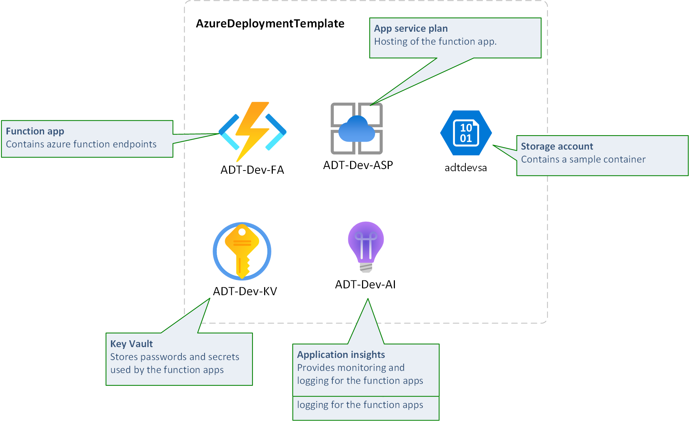

# Introduction 

This is an Azure function project with deployment, Azure DevOps pipeline (YML), environment management and much more - ready to get started in 10 minutes. (Well, maybe not the first time you try ;-), but it really is a quick start.)

This project deploys resources as outlined in the following overview drawing.



It contains all the scaffolding needed to get started with an Azure function project with automated deployment using Azure DevOps. 

It has all been setup for easy configuration and manageability, yet with a powerful and scalable approach. 

What do you get by starting with this project?
- Ready to go Function app project and test project
- Dependency injection
- Configuration management (Local configuration, App settings deployment, KeyVault configuration and all deployment needed to connect the dots)
- Sample unit test with Mock, configuration and dependency injection configuration.
- Azure Infrastructure deployment (IaC - Infrastructure As Code) including Azure function, Azure KeyVault (for storage of secrets), Storage account, Application insights (Logging). 
- A simple and powerful Powershell based deployment structure that allows you to organize your deployment scripts in an awesome way. 

# Getting Started

Setting this up for your own environment requires the following:

- Create service principal in AAD (Azure Active Directory). See [CreateServicePrincipal.md](Documentation/CreateServicePrincipal.md)
- Create resource group in Azure
- Assign permissions to the service principal
- Setup Service connection in Azure DevOps
- Setup your environment file with parameters for your environment. 
- Modify Deploy_Dev stage in azure-pipelines.yml, pointing to your target json environment file and serviceConnection.

## Adding a new environment

- Copy an existing environment.json file, like dev.json, to an appropriate name, i.e. test.json
- Edit test.json and adjust parameters according to the new environment. 
- In azure-pipelines copy the Deploy_Dev stage section, paste it and modify the new section stage name, displayname, environment, targetJson and serviceConnection parameters

You can test locally by navigating to the Deployment folder of the project and initiating install. I.e.: 
```
.\Install.ps1 .\Test.json
```

## Debugging

Debugging locally can be done using Azurite. If using Visual studio 2022, Azurite can be started by navigating to the following path and executing Azurite.exe. 

```
C:\Program Files\Microsoft Visual Studio\2022\Professional\Common7\IDE\Extensions\Microsoft\Azure Storage Emulator
```

See Microsoft documentation for further details: 

[Use the Azurite emulator for local Azure Storage development](https://docs.microsoft.com/en-us/azure/storage/common/storage-use-azurite?tabs=visual-studio)

**Sample request for GetProject:**

Make GET call to: http://localhost:7071/api/GetProject

```json
{
	"ProjectId":"A01"
}
```

Expected response:
```json
{
	"name": "Sampleproject",
	"title": "Sample title",
	"partitionKey": "project",
	"rowKey": "A01",
	"timestamp": "2022-07-09T22:32:16.526+02:00",
	"eTag": "W/\"datetime'2022-07-09T20%3A32%3A16.5260000Z'\""
}
```

# Install azure functions core tools in container

```bash

wget -q https://packages.microsoft.com/config/ubuntu/20.04/packages-microsoft-prod.deb
sudo dpkg -i packages-microsoft-prod.deb
sudo apt-get update
sudo apt-get install azure-functions-core-tools-4
```

sudo apt-get remove dotnet-sdk-3.1
sudo apt-get autoremove

wget https://packages.microsoft.com/config/ubuntu/20.04/packages-microsoft-prod.deb -O packages-microsoft-prod.deb
sudo dpkg -i packages-microsoft-prod.deb

sudo apt-get update; \
sudo apt-get install -y apt-transport-https && \
sudo apt-get update && \
sudo apt-get install -y dotnet-sdk-6.0

dotnet --list-sdks